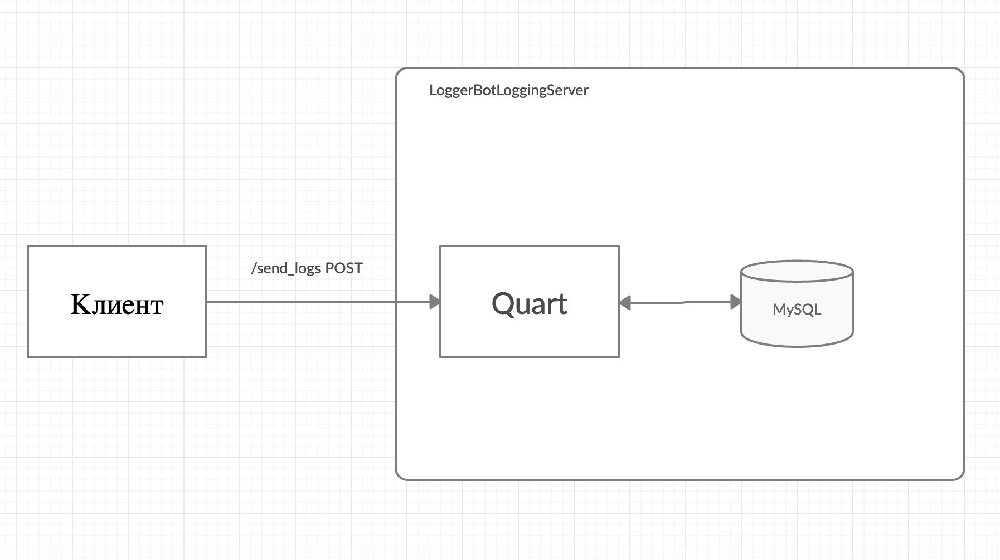

# LoggerBotLoggingServer
Сервер, который принимает логи от клиента и записывает их в базу данных
## Структура
Проект использует Quart - асинхронную версию фреймворка Flask, базу данных MySQL.
Представляет такое api:
- /send_logs - для отправки логов
- /create_user - вспомогательное api для создания пользователя в бд


Клиент в данном случае - является [logger](https://github.com/den-bibik/LoggerBotLogging),
его можно поставить из https://github.com/den-bibik/LoggerBotLogging

### /send_logs:

#### body:
```
{
  "data": {
    "user": "username",
    "pid": 1,
    "p_name": "process name",
    "post_time": "2020-05-05T12:22:22+00:00",
    "logs": [
      {
        "level": "error",
        "msg": "log message",
        "event_at" : "2020-05-05T12:22:22+00:00",
        "p_description": "process_user_description"
      },
      {
        "level": "warning",
        "msg": "other log message",
        "event_at" : "2020-05-06T12:22:22+00:00",
        "p_description": "process_user_description"
      }
      ...
    ]
  }
}
```
**logs** - в данном случае массив из логов пользователя, которые необходимо записать в базу данных

#### headers:
```
'Content-Type': 'application/json'
'X-User-Token': 'a5amka921jkmakguasl1kna9u6sl1241'
```
**X-User-Token** - токен захешированный в md5, по которому происходит аутентификация клиента

#### responses:
- 200: `{"code": 200, "message": "Logs added successfully"}` - Логи успешно были добавлены в таблицу user_logs
- 400: `{"code": 400, "message": "BadRequest"}` - Был получен некорректный запрос
- 403: `{"code": 403, "message": "Forbidden"}` - Клиент не прошел аутентификацию
- 500: `{"code": 500, "message": "InternalServerError"}` - Внутренняя ошибка сервера
### /create_user
#### body:
```
{
  "user": "username",
  "password": "password",
  "tel_id": "tel_id"
}
```

#### headers:
```
'Content-Type': 'application/json'
'X-Api-Key': 'Some-Api-Key'
```
**X-Api-Key** - специальный ключ данного ендпоинта (задается в переменной среды LOGGER_API_KEY). 
####responses:
- 200: `{"code": 200, "message": "Logs added successfully"}` - Пользователь был успешно добавлен в таблицу users
- 400: `{"code": 400, "message": "BadRequest"}` - Был получен некорректный запрос
- 403: `{"code": 403, "message": "Forbidden"}` - Клиент не прошел аутентификацию
- 500: `{"code": 500, "message": "InternalServerError"}` - Внутренняя ошибка сервера


## Принцип работы
Сервер получает запрос от клиента, проверяет пару (user, X-User-Token) на наличие в таблице users.
Если пользователь с данной парой существует, то добавляем логи в таблицу user_logs, иначе возвращаем пользователю 403

Пользователь создается через /create_user


## Сборка и использование
### Установка
Ставим виртуальное окружение, например
virtualenv:`pip3 install virtualenv`
Клонируем репозиторий:

```
git clone https://github.com/WesBAn/LoggerBotLoggingServer
```
Устанавливаем окружение и зависимости:
```
python3 -m virtualenv venv
source venv/bin/activate
pip install -r requirements.txt
```

Для запуска необходимо поднять сервер MySQL
### Настройка сервера
Логин и пароль для MySQL можно вынести в переменные среды, пример:
```
export LOGGER_DB_USER=user
export LOGGER_DB_PASSWORD=password
```
IP сервера и порт нужно записать в конфиг quart_config
>bot_logging_server/config/quart_config.py
```
PORT = 5000
HOST = "0.0.0.0"
```
IP mysql сервера, mysql порт и название бд нужно записать в конфиг config
>bot_logging_server/config/config.py
```
DB_NAME = "test_db"
MYSQL_PORT = 8889
MYSQL_HOST = "localhost"
```

Необходимо запустить иницализацию бд и таблиц:
```
python3 setup_database.py --user=user --password=password --port=port
```
- `--user` - MySQL логин
- `--password` - MySQL пароль
- `--port` - MYSQL port сервера

Чтобы работал api /create_user нужно определить в параметрах среды Api ключ
```
export LOGGER_API_KEY=yourapikey
```

### Запуск
```
python3 app.py
```
или
```
python3 app.py --host=localhost --port=5000 --user=user --password=password
```
Где:
- `--host` - ip сервера
- `--port` - port сервера
- `--user` - MySQL логин
- `--password` - MySQL пароль

### Документация
```
source venv/bin/activate
export PYTHONPATH=`pwd`
cd bot_logging_server
python3 -m pydoc -p port
```
По полученной ссылке можно посмотреть документацию

### Тестирование
Для тестирования используется стандартный фреймворк pytest
```
source venv/bin/activate
pytest
```

### Pylint
```
source venv/bin/activate
python3 -m pylint bot_logging_server
```

### Сборка колеса
```
source venv/bin/activate
python3 setup.py bdist_wheel
```
